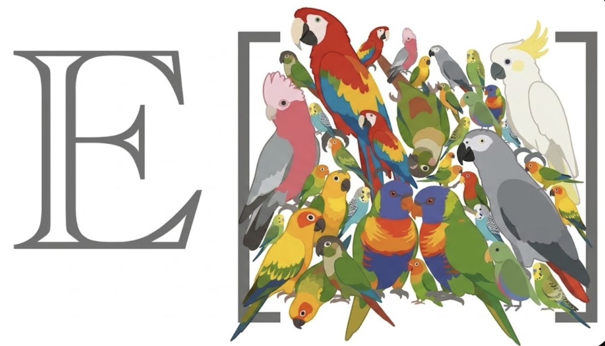

# umriss



`umriss` is an agent-facing Python CLI for constructing auditable synthetic
support banks from reported survey marginals. It does not claim to recover
respondents. It creates candidate response profiles, evaluates them with a
model, and estimates mixture weights whose implied marginals approximate the
reported targets.

Marginals do not identify a unique joint distribution. A support design
therefore encodes consequential assumptions. In `umriss`, those assumptions
live in a versioned, declarative design rather than inside a prompt builder.

The checked-in tutorial uses five weighted marginals derived from 6,104
respondents in Pew Research Center's American Trends Panel Wave 154. The
microdata is used only to construct aggregate targets; leave-one-out validation
fits four marginals and predicts the omitted fifth marginal.

## Direct-prediction baselines

Umriss can construct and run both direct baselines used in leave-one-out
evaluation. A one-shot job sees only the omitted item. A conditioned-direct job
sees the real marginals for every held-in item, but never the omitted marginal.

```bash
umriss baseline build \
  --metadata examples/pew_w154/pew_w154_metadata.json \
  --mode both --tag pew_w154_baselines --out run/baselines

umriss baseline export \
  --prompts run/baselines/pew_w154_baselines_baseline_prompts.jsonl \
  --path run/baselines/pew_w154_baselines.jobs.ep \
  --model gpt-5.5

umriss baseline run \
  --jobs run/baselines/pew_w154_baselines.jobs.ep \
  --output run/baselines/pew_w154_baselines.results.ep
```

Register and strictly parse the results before passing the resulting
`*_one_shot.csv` and `*_conditioned_direct.csv` files to `umriss validate marginals`.

## Plot a leave-one-out run

`umriss validate marginals` writes the canonical data behind the plots: per-item predictions
and errors, method summaries, fit diagnostics, fold-specific persona weights,
and pre-calibration support-uniformity measurements. Generate the associated
figures directly:

```bash
umriss plot validation \
  --derived examples/pew_w154/run/derived \
  --tag pew_w154_diff1_uniform_n208 \
  --out run/plots \
  --format svg
```

This writes five figures and a JSON manifest: method comparison, error by
omitted item, effective-support and weight-concentration diagnostics,
fold-specific persona weights, and equal-weight support uniformity. SVG, PNG,
and PDF output are supported.

## Export the fitted twins to EDSL

Validation uses a different weight vector for every omitted marginal. For a
deployable twin population, first fit all reported marginals:

```bash
umriss fit \
  --support examples/pew_w154/run/banks/pew_w154_diff1_uniform_n208_probabilities.csv \
  --metadata examples/pew_w154/pew_w154_metadata.json \
  --tag pew_w154_full_fit \
  --out run/full_fit
```

Then export an EDSL `AgentList`:

```bash
umriss twins export-edsl \
  --points examples/pew_w154/run/uniform_n96/bank/pew_w154_diff1_uniform_n96_points.csv \
  --points examples/pew_w154/run/uniform_repair_r1/bank/pew_w154_diff1_uniform_repair_r1_points.csv \
  --points examples/pew_w154/run/uniform_repair_r2/bank/pew_w154_diff1_uniform_repair_r2_points.csv \
  --weights run/full_fit/pew_w154_full_fit_weights.csv \
  --persona-trait gender_attitudes \
  --path run/full_fit/pew_w154_full_fit.agents.ep
```

Each EDSL agent receives a visible, user-named persona trait—in this example,
`gender_attitudes`—written in the second person. Umriss does not replace EDSL’s
ordinary agent instruction. Support-generation and probability-elicitation
instructions are not exported. The normalized mixture coefficient is bundled
as the hidden `_weight` trait and also written to a CSV sidecar keyed by agent
name. EDSL serializes underscore-prefixed traits but excludes them from model
prompts; it does not automatically use `_weight` when sampling an `AgentList`.
Both the `AgentList` and its manifest are round-trip verified when written.

## Install

```bash
uv tool install .
```

## Design first

Inspect the checked-in declarative design:

```bash
umriss design validate \
  --metadata examples/pew_w154/pew_w154_metadata.json \
  --design examples/pew_w154/pew_w154_design.yaml
```

Validate its feasibility:

```bash
umriss battery inspect examples/pew_w154/pew_w154_metadata.json
```

Compile prompts and audit artifacts:

```bash
umriss support build \
  --metadata examples/pew_w154/pew_w154_metadata.json \
  --preset uniform-patterns \
  --n-support 96 \
  --tag pew_w154_diff1_uniform_n96 \
  --out examples/pew_w154/run/uniform_n96
```

The build writes:

- `<tag>_resolved_design.yaml`
- `<tag>_support_plan.csv`
- `<tag>_coverage.csv`
- `<tag>_prompts.jsonl`
- `<tag>_prompts.html`

Review the resolved design, coverage table, and prompt HTML before model
execution.

## Execute through Expected Parrot

```bash
umriss support export \
  --prompts examples/pew_w154/run/uniform_n96/pew_w154_diff1_uniform_n96_prompts.jsonl \
  --path examples/pew_w154/run/uniform_n96/pew_w154_diff1_uniform_n96.jobs.ep
```

```bash
ep run \
  --jobs examples/pew_w154/run/uniform_n96/pew_w154_diff1_uniform_n96.jobs.ep \
  --output examples/pew_w154/run/uniform_n96/pew_w154_diff1_uniform_n96.results.ep
```

`umriss` prepares and registers jobs but does not conceal the external model
execution boundary.

## Parse, fit, and test

```bash
umriss support register-results \
  --results examples/pew_w154/run/uniform_n96/pew_w154_diff1_uniform_n96.results.ep \
  --prompts examples/pew_w154/run/uniform_n96/pew_w154_diff1_uniform_n96_prompts.jsonl \
  --tag pew_w154_diff1_uniform_n96 \
  --out examples/pew_w154/run/uniform_n96/raw
```

```bash
umriss support parse \
  --raw examples/pew_w154/run/uniform_n96/raw/pew_w154_diff1_uniform_n96_raw.csv \
  --metadata examples/pew_w154/pew_w154_metadata.json \
  --tag pew_w154_diff1_uniform_n96 \
  --out examples/pew_w154/run/uniform_n96/bank
```

```bash
umriss validate marginals \
  --support examples/pew_w154/run/banks/pew_w154_diff1_uniform_n208_probabilities.csv \
  --metadata examples/pew_w154/pew_w154_metadata.json \
  --tag pew_w154_diff1_uniform_n208 \
  --out examples/pew_w154/run/derived
```

Parsing is strict: probability vectors with negative entries, wrong lengths, or
sums other than one are invalid. They are not silently clipped or normalized.

The 96-row full-pattern bank is measured before fitting. If its returned
probabilities are not sufficiently uniform, use `umriss support
augment-uniform`, run and parse the new jobs, then combine them with `umriss
support merge`. `umriss support uniformity` checks marginal balance, duplicate
probability vectors, joint modal-response coverage, matrix rank, and effective
rank. `umriss validate marginals` refuses a bank that fails preflight unless the analyst
explicitly requests the diagnostic escape hatch.

## Design schema

A schema-v1 design declares:

- support-bank size and random seed;
- complete or explicitly partial coverage;
- option-coverage, pattern-anchor, and user-profile components;
- global, item-specific, grouped, or explicit coherence;
- balanced response-intensity assignments;
- profile framing and demographic-invention rules;
- probability semantics and minimum probabilities;
- optional strictly validated Jinja templates.

Battery metadata declares each scale as `ordinal` or `nominal`. Ordinal scales
also declare `low_to_high` or `high_to_low`; `umriss` never infers response
meaning from option position.

See [the browser tutorial](docs/index.html) and
[the CLI specification](CLI_SPEC.md).
